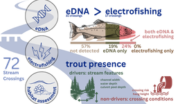

# Infographic design for a Rainbow Trout eDNA study

## About

- Client: Suzanne Stevenson
- Institution: Poseidon Environmnetal Ltd.
- Contact phone number: 780-223-8533
- Contact email: suzanne@poseidonenvironmentalltd.com
- Title: Rainbow Trout presence at stream crossings in Alberta's Eastern Slopes: insights from
environmental DNA, electrofishing, and habitat assessments

## Information from client

- [Graphical Abstract Outline](./docs/outline_GA.md)
- [Infographic Outline](./docs/outline.md)
- [Visual Assets](./docs/FSCP_InspectionProtocolsManual_V06.pdf)

## Product

### Graphical abstract
#### version 1 (2026-06-25)

## Time line

| Item | Due | Communication with client |
| ----------- | ------------- | ------ |
| Draft of the text content and design idea | Jun.19 | agree on the text content |
| Graphic abstract first product    | Jun.26 | review of the product  |
| Infographic product         | Jul.3 | review of the product  |
| Revision(s)*              | Jul.5  |   | 

*Sunny will provide 2 rounds of minor revisions for the final product. Minor revisions are usually within 1 hour of editing time for each round of revisions. After that it will be charged $40 per hour.

## Expected output

### Graphical abstract
- Canadian Journal of Fisheries and Aquatic Sciences (CJFAS)
- [Guideline](https://cdnsciencepub.com/journal/cjfas/authors)
- Authors are encouraged to submit an illustration, diagram, equation, or other informative visual that explains the central message of the article and entices readers. The maximum allowable size is 40 mm (150 pixels) high by 85 mm (320 pixels) wide.

### Infographic
- Dimension: 1920x1080 pixel
- Orientation: Horizental
- Color: coloured
- File type: PNG, JPEG, PDF

## Expected compensation

- Graphical Abstract: $450 – $650 CAD
- Infographic: $900 – $1,100 CAD

Payment is due immediately upon receipt of the final deliverables. Payment can be made via one of the following methods:

- Interac e-Transfer: Send to sunnyyctseng@gmail.com
- Direct Deposit: Bank details provided upon request (or see attached bank details)
- Cheque: Mail to 1228 Arbutus Street, Vancouver, BC, V6J 3W6

## Tools

I will be using these platforms for designing: 

- [GIMP](https://www.gimp.org/): an image editor for most of the visual design, including digital drawing.

- [Krita](https://krita.org/en/): a professional open source painting program

- [Canva](https://www.canva.com/): a design tool for presentations and social media. I will be using canva for the text design. 

My design style. Visit my website to view more previous works: https://sunshineland.netlify.app/science/

## References

- [FUSE consulting company](https://www.fuseconsulting.ca/infographics)
- [FRI research](https://friresearch.ca/search/?frisearchable_posts%5BhierarchicalMenu%5D%5Btaxonomies_hierarchical.publication_type.lvl0%5D%5B0%5D=Summaries%20and%20Communications&frisearchable_posts%5BhierarchicalMenu%5D%5Btaxonomies_hierarchical.publication_type.lvl0%5D%5B1%5D=Infographics)

